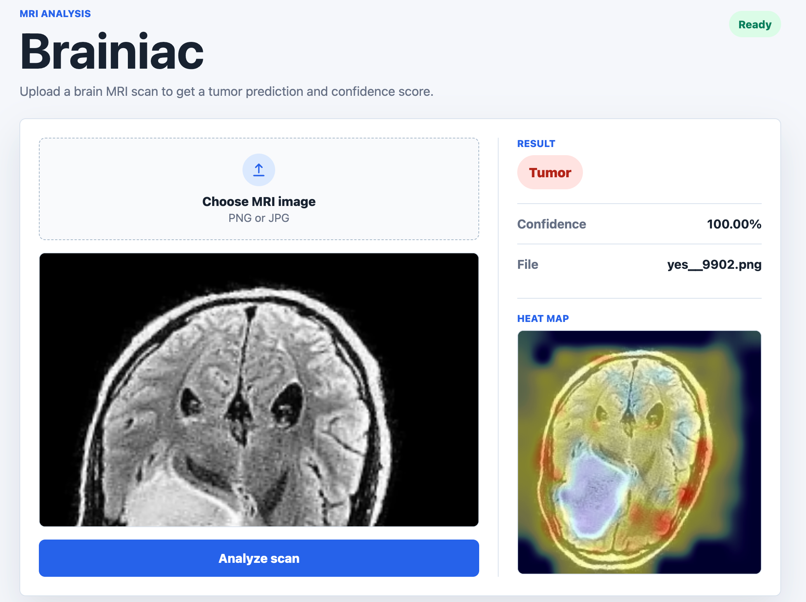

# Brainiac

Brainiac is a Flask application for classifying brain MRI scans with a fine-tuned Vision Transformer model. The app accepts an MRI image, runs inference, and returns a tumor / no-tumor prediction with a confidence score. When a tumor is predicted, Brainiac also generates a Grad-CAM style heat-map overlay to highlight the image region that influenced the model most.



## Team

MacDonald Bridge: Chloe, Masuma, and Maryanne

## Features

- MRI image upload workflow
- Vision Transformer image classification
- Confidence score reporting
- Grad-CAM style heat-map overlay for tumor predictions
- Batch test script that writes predictions to `results.csv`
- Environment-based configuration for local and judging machines

## Prediction Output

Brainiac shows different outputs depending on the model prediction:

| Prediction | UI Output |
| --- | --- |
| `tumor` | Prediction label, confidence percentage, and a heat-map overlay on the uploaded MRI image. |
| `no tumor` | Prediction label and confidence percentage only. No heat map is shown. |

## Grad-CAM Heat Maps

Brainiac uses a Grad-CAM style visualization to make tumor predictions easier to inspect. After the model predicts the `tumor` class, the app:

1. Runs a gradient pass for the tumor class.
2. Converts the Vision Transformer patch activations into a 2D attention map.
3. Resizes the map to match the uploaded MRI image.
4. Blends the heat map with the original scan.
5. Displays the highlighted image in the result panel.

Generated heat-map files are saved in:

```text
static/highlighted/
```

The generated filenames follow this pattern:

```text
heatmap_<uploaded-file-name>.png
```

These generated heat maps are ignored by Git because they are runtime outputs.

## Tech Stack

- Python 3.10+
- Flask
- PyTorch and Torchvision
- Hugging Face Transformers
- Pandas
- HTML, CSS, and JavaScript

## Project Structure

```text
.
├── app.py                  # Flask web application
├── test.py                 # Batch inference script for CEC test images
├── requirements.txt        # Python dependencies
├── templates/
│   └── index.html          # Web UI template
├── static/
│   ├── styles.css          # App styling
│   ├── app.js              # Client-side image preview
│   ├── uploads/            # Uploaded images
│   └── highlighted/        # Grad-CAM output examples
├── CEC_2025/
│   ├── CEC_test/           # Test images
│   ├── no/                 # No-tumor samples
│   └── yes/                # Tumor samples
└── competition-info/       # Competition documentation
```

## Setup

### 1. Create a virtual environment

Use Python 3.10 or newer. Python 3.11 is recommended.

```sh
python3.11 -m venv venv
source venv/bin/activate
```

On Windows:

```sh
python -m venv venv
.\venv\Scripts\activate
```

### 2. Install dependencies

```sh
pip install -r requirements.txt
```

### 3. Download the model

Download the trained model from the Google Drive folder and place it in the project root.

[Download model from Google Drive](https://drive.google.com/drive/folders/1RMO9VaVmPAmpuvj3_KWvFcfCKGfVryfz?usp=drive_link)

Expected local path:

```text
vit_mri_model_augmented_final.pth
```

Access to the Drive folder may require permission from the project team.

### 4. Configure environment variables

Create a `.env` file in the project root:

```sh
CEC_2025_dataset="/absolute/path/to/brainiac-cec2025/CEC_2025/CEC_test"
MODEL="/absolute/path/to/brainiac-cec2025/vit_mri_model_augmented_final.pth"
```

Environment variables:

| Variable | Description |
| --- | --- |
| `CEC_2025_dataset` | Absolute path to the test image folder used by `test.py`. |
| `MODEL` | Absolute path to the downloaded `.pth` model weights file. |

## Running the Web App

```sh
source venv/bin/activate
flask --app app run
```

Open the local URL printed by Flask, usually:

```text
http://127.0.0.1:5000
```

## Running Batch Tests

The batch script reads images from `CEC_2025_dataset`, predicts each image label, and appends the output to `results.csv`.

```sh
source venv/bin/activate
python test.py
```

The output file uses this format:

```csv
Test Image,Result
test__001.png,no
test__002.png,yes
```

## Troubleshooting

### `MODEL is not set`

Check that `.env` exists and includes a valid `MODEL` path.

### `Model file was not found`

Download the model file and confirm the path matches the `MODEL` value in `.env`.

### Dependency install fails on Python 3.9

Some pinned dependencies require Python 3.10 or newer. Recreate the virtual environment with Python 3.10+.

### No test images are processed

Confirm `CEC_2025_dataset` points directly to the folder containing files named like `test__001.png`.

## Notes

Brainiac is a competition prototype and is not intended for clinical diagnosis. Predictions should be interpreted only as model output for the CEC 2025 project workflow.
